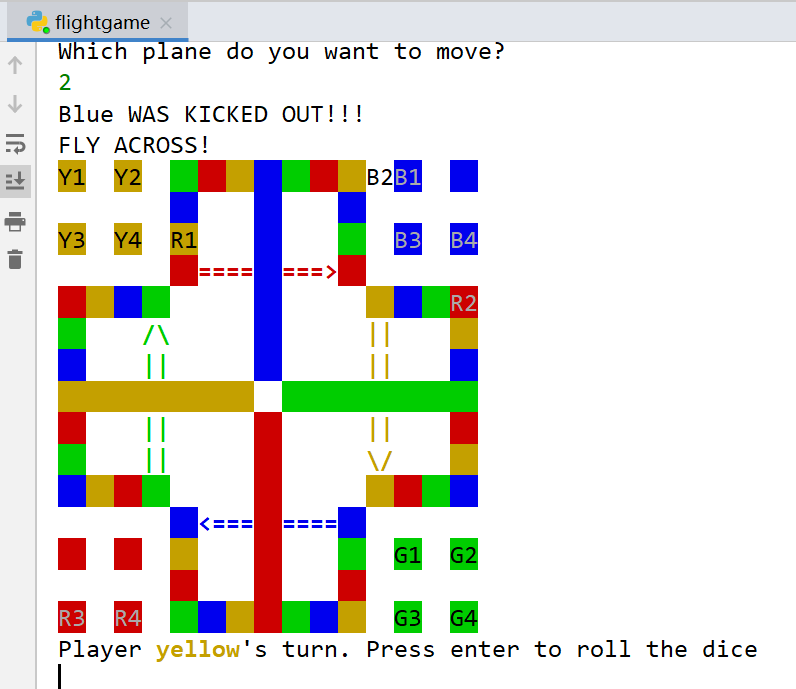
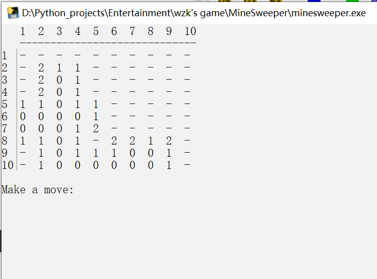
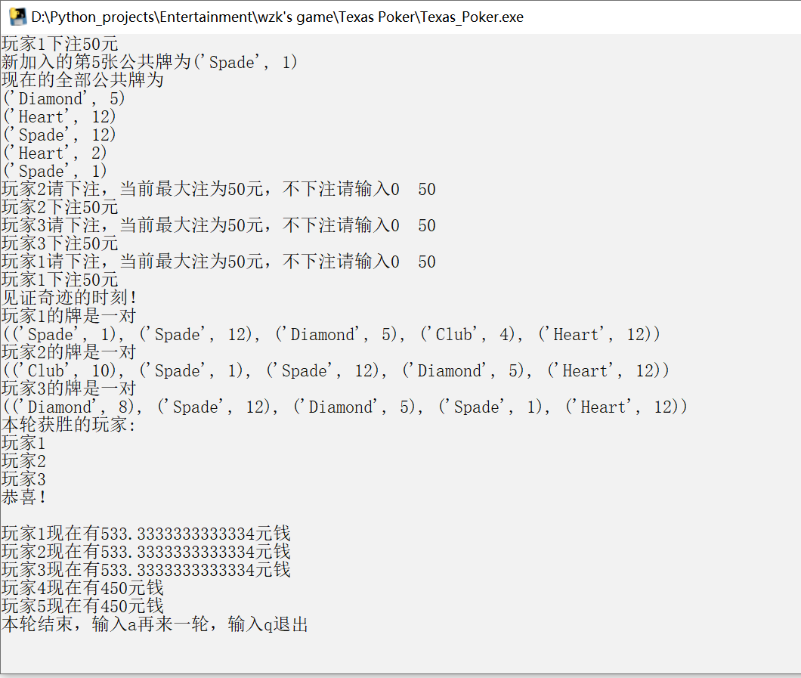
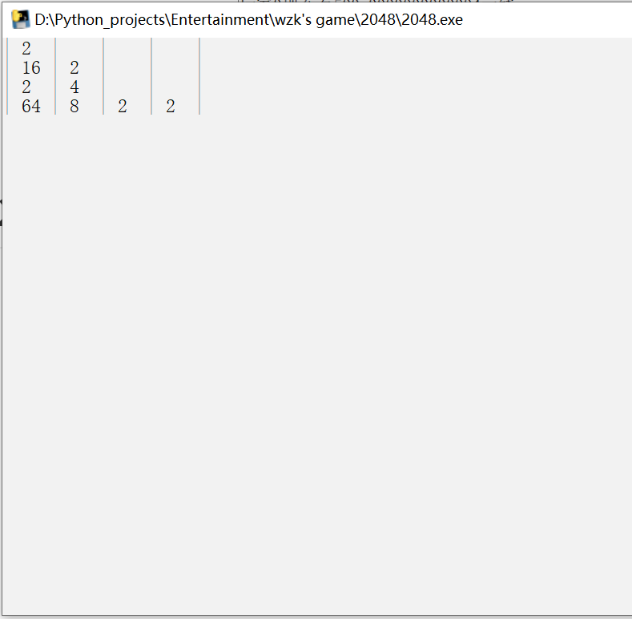
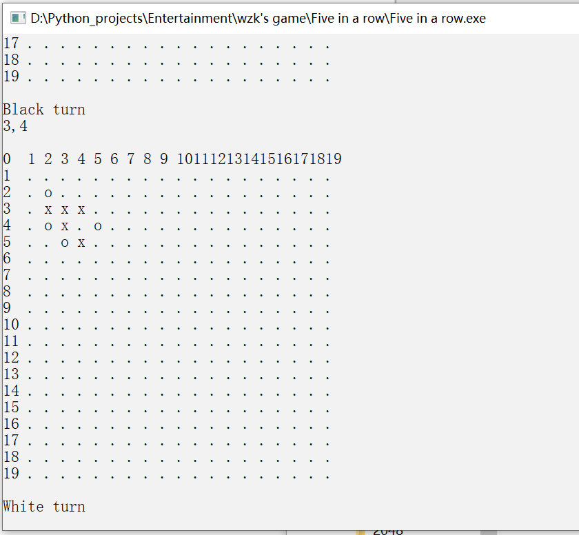

## wzk's Game Collection

大一大二闲来无事用python、c写了一些小游戏，都是控制台操作，单机多人对战，没有使用pygame制作GUI界面，没有AI，纯属娱乐：）

目前游戏列表：**飞行棋、扫雷、德州扑克、2048、五子棋**

## 飞行棋

Flight Game/Flight Game.py

console版飞行棋（flight game / flying chess）

**在pycharm或jupyter notebook中打开！否则颜色无法渲染，会出现乱码**

Preview：

## 扫雷

MineSweeper/minesweeper.exe

**操作方法：**

**开启：输入 row coloum    （如打开第一行第一列为"1 1")**

**标记：输入 row column 0 （如标记第一行第一列为"1 1 0")**

Preview：

##  德州扑克

Texus Poker/Texus_Poker.exe

console版德扑

已知all in、再来一轮存在bug~~但我懒得修复~~

Preview：

## 2048

2048/2048.exe

**操作方法**：输入W、A、S、D并按回车

Preview：

## 五子棋：

Five in a row/five in a row.exe

**操作方法**：输入x,y并按回车

